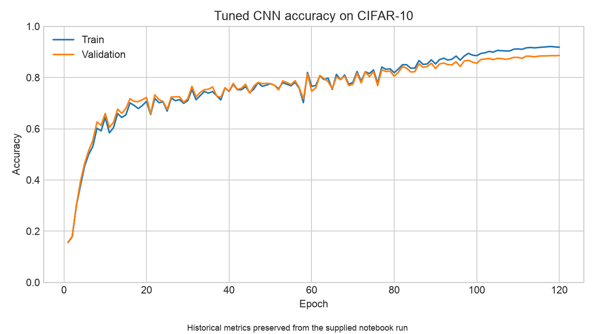

# CIFAR-10 Classifiers and ResNet-18

[](https://github.com/volkthienpreecha/cifar10-resnet-training/actions/workflows/ci.yml)

A compact PyTorch study of image-classification architectures on CIFAR-10: a fully connected baseline, a LeNet-style CNN, a custom ResNet-18, and a tuned convolutional model. The project separates reusable model and training code from a readable experiment walkthrough.



## Highlights

- ResNet-18 implemented from residual blocks, including projection shortcuts.
- Deterministic 40k/10k train-validation split.
- Device selection for CUDA, Apple Metal, and CPU.
- Reusable CLI that records metrics and model weights together.
- Fast CPU tests for tensor shapes, residual behavior, training, and data splitting.

## Recorded results

These values come from the executed notebook supplied with the original experiment. They are historical validation results from one split—not newly reproduced test-set measurements.

| Model | Epochs | Validation accuracy |
|---|---:|---:|
| Fully connected network | 15 | 51.26% |
| Simple CNN | 15 | 59.63% |
| Custom ResNet-18 | 15 | 81.62% |
| Tuned CNN | 120 | **88.60%** |

The tuned run combines random cropping and flipping, batch normalization, dropout, label smoothing, SGD with momentum, and cosine learning-rate decay. Its complete epoch history is available in [`artifacts/training_history.csv`](artifacts/training_history.csv).

## Architecture

The ResNet follows the CIFAR-10 variant of ResNet-18: a 3×3 convolutional stem, four two-block stages with 64/128/256/512 channels, adaptive average pooling, and a linear classifier. A projection shortcut aligns spatial and channel dimensions whenever a stage downsamples.

```text
32×32 RGB image
  → 3×3 stem
  → [64] × 2 residual blocks
  → [128] × 2 residual blocks, stride 2
  → [256] × 2 residual blocks, stride 2
  → [512] × 2 residual blocks, stride 2
  → global average pooling
  → 10-class logits
```

## Setup

Python 3.10 or newer is required.

```bash
python -m venv .venv
source .venv/bin/activate
python -m pip install -e ".[dev]"
```

## Train a model

The first run downloads CIFAR-10 through `torchvision`.

```bash
cifar10-train \
  --model resnet18 \
  --device auto \
  --data-dir data/cifar10 \
  --epochs 30 \
  --output-dir runs/resnet18
```

Available model names are `fcnn`, `cnn`, `resnet18`, and `tuned`. Run `cifar10-train --help` for all options.

## Walkthrough

[`notebooks/cifar10_resnet_walkthrough.ipynb`](notebooks/cifar10_resnet_walkthrough.ipynb) explains the architecture progression and loads the preserved result artifacts. Expensive training is disabled by default; the CLI is the canonical training path because it saves configuration, metrics, and weights together.

## Repository structure

```text
src/cifar10_resnet/       models, data pipeline, training engine, and CLI
tests/                    CPU-only behavioral tests
notebooks/                curated project walkthrough
artifacts/                historical metrics and learning curve
.github/workflows/ci.yml  lint and test automation
```

## Test

```bash
python -m pytest -q
python -m ruff check src tests
```

The tests use synthetic tensors and do not download CIFAR-10.

## Limitations

- Historical results represent a single split and seed.
- The repository does not include trained checkpoints.
- No uncertainty, calibration, or robustness analysis is reported.
- Full training is compute-intensive and is not run in CI.

## References

- K. He, X. Zhang, S. Ren, and J. Sun, [Deep Residual Learning for Image Recognition](https://arxiv.org/abs/1512.03385), 2015.
- A. Krizhevsky, [Learning Multiple Layers of Features from Tiny Images](https://www.cs.toronto.edu/~kriz/cifar.html), 2009.
- [PyTorch](https://pytorch.org/) and [torchvision](https://pytorch.org/vision/stable/).

## Provenance

The model implementations and recorded experiments began as academic computer-vision work and were subsequently cleaned, tested, and packaged for reproducible public presentation. Classroom prompts, grading utilities, and submission code are intentionally excluded.
